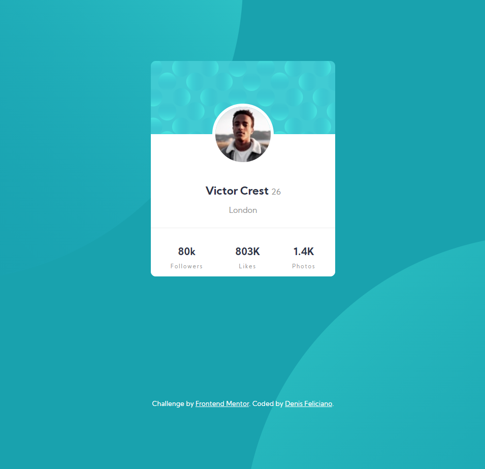

# Frontend Mentor - Profile card component solution

This is a solution to the [Profile card component challenge on Frontend Mentor](https://www.frontendmentor.io/challenges/profile-card-component-cfArpWshJ). Frontend Mentor challenges help you improve your coding skills by building realistic projects. 

## Table of contents

* [The challenge](#the-challenge)
* [Links](#links)
* [Built with](#built-with)
* [Author](#author)
 

### The challenge

* Build out the project to the designs provided

 

 

### Links

* Solution URL: [Add solution URL here](https://www.frontendmentor.io/solutions/card-component-solution-Oc_lqcl39)
* Live Site URL: [Add live site URL here](https://denisfelic.github.io/profile-card-component/)

### Built with

* Semantic HTML5 markup
* CSS custom properties
* Flexbox
* CSS Grid
* Mobile-first workflow
 
 

## Author

* Website - [www.denis-dev.com](http://www.denis-dev.com)
* Frontend Mentor - [@denisfelic](https://www.frontendmentor.io/profile/denisfelic)
 
 
 
